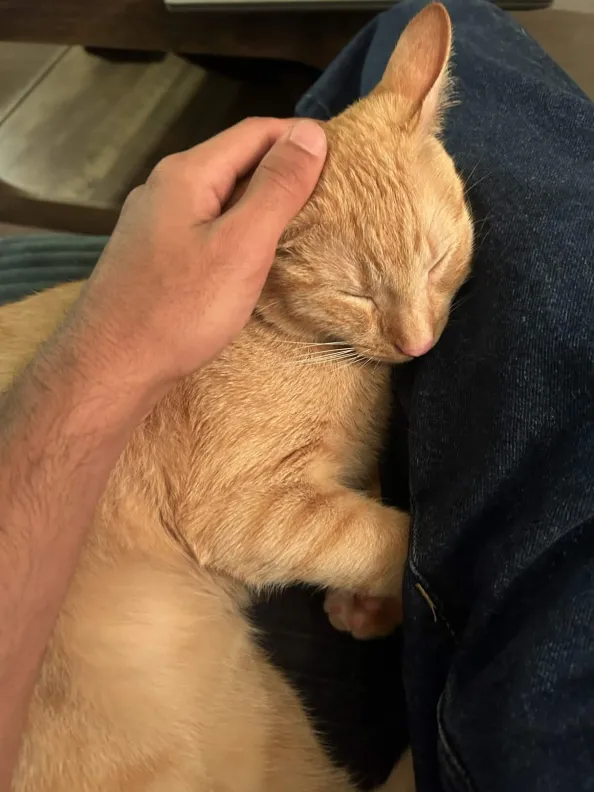

# Nishant's User Page

## About Me!

Hey everyone!  
I am **Nishant Sharma**, a *Sophomore* at UCSD.  

My hobbies are:  
1. Hiking
2. Cooking and Baking
3. Playing with cats!

My favourite artists are:  
- Justin Bieber
- Dominic Fike
- Malcolm Todd
- 5sos
- NBHD

> Fun fact: The name of my favourite cat is Pickles.  

## As a programmer:

I want to try and get into backend development. I am not sure how things are working out for me but I wanna put myself in unfamiliar situations and just grow.

My favourite line of code is:  
`print("Hello World)`

Do you fw pickles?
-[] Yes

My github page is [Github](https://github.com/SharmaNishant11)
Check the [read.md](/LAB1_CSE110/README.md)
Go back to the [top](#nishants-user-page)

